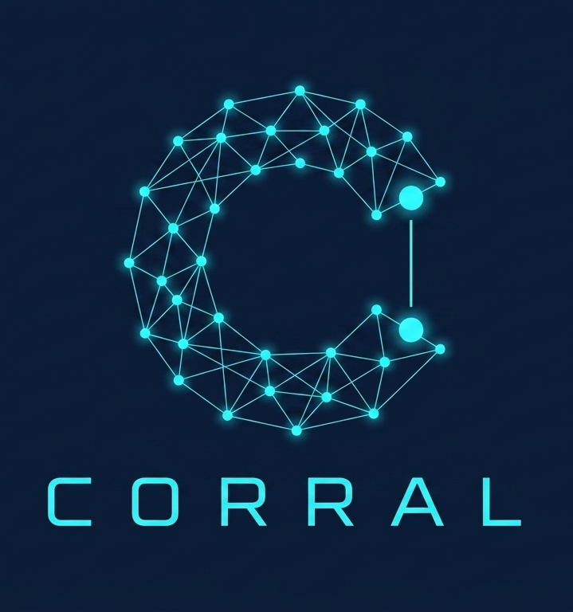

# Claude: Orquestador de Recursos Remotos para Agentes en Loop

<div align=right>
<sub><b>CORRAL: Claude Orchestrated Runtime for Remote Agent Loop</b><i><br>Sistema que permite que Claude Code invoque agentes LLM externos<br> como herramientas MCP durante sesiones de trabajo autónomo</i></sub>
</div>

## ¿Por qué?



En un entorno habitual de trabajo con LLMs, un usuario tiene ya instalados varios clientes CLI: Claude Code, Gemini, OpenCode u otros. Cada uno tiene sus puntos fuertes, sus modelos y sus costes. El problema es que operan en silos: no hay forma nativa de que uno invoque a otro.

Claude Code ya tiene el bucle de control, el acceso al filesystem y el criterio de parada. Lo que no tiene es capacidad para delegar subproblemas a otros modelos con perspectivas distintas. CORRAL resuelve eso exponiendo cada CLI externo como herramienta MCP: Claude Code llama a `gemini_run` o `opencode_run` igual que llama a `bash`.

El problema no es solo técnico. Los modelos LLM tienen costes de razonamiento distintos: mantener a Claude concentrado en la coordinación y el criterio de calidad, mientras tareas de generación simple (borradores, análisis, ficheros) se delegan a modelos más rápidos y baratos, es una decisión de diseño que afecta tanto al coste como al resultado final.

Las plataformas SaaS de orquestación ofrecen esta capacidad, pero a cambio de pérdida de control, dependencia de proveedor y envío de datos a intermediarios. Este sistema resuelve el mismo problema desde la infraestructura propia.

## ¿Qué?

### Arquitectura: Control Plane / Data Plane

El sistema opera bajo una separación de responsabilidades clara:

<div align=center>

|Control Plane|Data Plane|
|-|-|
**Claude Code**|**Gemini, OpenCode, Ollama**
Decide, planifica, delega y ensambla. Es la unidad de razonamiento.|Ejecutan subproblemas acotados, producen artefactos y terminan sin estado persistente. No saben que están siendo orquestados.

</div>

```
Claude Code (orquestador)
    │
    │    
    ├── gemini_run / gemini_run_async / gemini_done
    │       └── gemini_mcp.py  ->  gemini CLI  ->  Google Gemini
    │
    │    
    ├── opencode_run / opencode_run_async / opencode_done
    │       └── opencode_mcp.py  ->  opencode-wrapper.sh  ->  z.ai / OpenCode
    │
    │        
    └── ollama_run / ollama_run_async / ollama_done
            └── ollama_mcp.py  ->  HTTP API  ->  Ollama (local)
```

### El sistema de ficheros como bus de datos

- El output de cada agente son ficheros escritos en un directorio de trabajo (workdir).
- El orquestador inspecciona los resultados con sus propias herramientas (Read, Glob, Grep).

Esto elimina la dependencia de flujos de texto volátiles y permite verificación determinista sobre el artefacto final.

### Modos de invocación

<div align=center>

| Herramienta | Modo | Comportamiento |
|---|---|---|
| gemini_run / opencode_run / ollama_run | Síncrono | Bloquea hasta terminar; escribe ficheros en workdir |
| gemini_run_async / opencode_run_async / ollama_run_async | Async | Devuelve job_id inmediatamente |
| gemini_done / opencode_done / ollama_done | Consulta | Devuelve "pendiente", "listo" o "error: ..." |

</div>

Los tres servidores son estructuralmente idénticos — solo difieren en el mecanismo de invocación. Los tokens de Gemini y OpenCode se imputan a su propio proveedor; Ollama es local y no tiene coste de API.

### Limitaciones actuales

<div align=center>

| Limitación | Descripción |
|---|---|
| Persistencia volátil | _jobs vive en memoria del proceso MCP. Un reinicio de sesión pierde todos los job_ids activos. |
| Sin retry automático | Si un agente falla a mitad de tarea, no hay rollback ni reintento. |
| Sin observabilidad | No hay logs estructurados del ciclo de vida de cada job. |
| Aislamiento por convención | La seguridad depende de que el prompt especifique un workdir adecuado. |

</div>

## ¿Para qué?

### Arbitraje de costos y especialización

<div align=center>

| Agente | Rol | Velocidad |
|---|---|---|
| Gemini | Verificador / critic | ~30 segundos |
| OpenCode / GLM-5.1 | Generador / arquitecto | ~2-3 minutos |
| Ollama / qwen2.5:14b | Inferencia local / sin coste de API | variable (CPU-only) |

</div>

### Paralelismo real

El modo async permite lanzar varios agentes simultáneamente sobre subtareas independientes. El tiempo total se aproxima al del agente más lento, no a la suma de todos.

### Extensibilidad sin dependencia de proveedor

El patrón "agente como herramienta" permite añadir cualquier CLI con modo no-interactivo sin modificar el orquestador.

Frente a plataformas SaaS: la ventaja es control total. La contrapartida es real: las plataformas cerradas incluyen observabilidad, retry logic y gestión de estado que aquí son responsabilidad del operador.

### Frente a las alternativas

<div align=center>

| Alternativa | Sí | Pero | Y entonces CORRAL… |
|---|---|---|---|
| **LangChain** | Muy madura, gran ecosistema | Abstracción excesiva, difícil de depurar, tus datos pasan por su stack | CORRAL es transparente: cada llamada es un proceso que puedes inspeccionar, matar o redirigir desde el terminal |
| **LlamaIndex** | Excelente para RAG y contexto documental | No es orquestación multi-agente real | CORRAL orquesta agentes heterogéneos con modelos y proveedores distintos, no documentos |
| **CrewAI** | Multi-agente con roles, fácil de arrancar | Los agentes no son CLIs reales, todo ocurre dentro del mismo proceso Python | CORRAL usa CLIs reales con sus propios modelos y costes imputados a sus proveedores, no a uno solo |
| **AutoGen** | Conversación entre agentes sofisticada | Complejo, opinionado, difícil de controlar el flujo | CORRAL delega el criterio al orquestador (Claude Code), no a un framework |
| **n8n / Make** | Visual, rápido para flujos simples | Ejecuta recetas fijas, sin razonamiento | CORRAL no ejecuta un flujo predefinido: Claude Code decide en tiempo real qué delegar, a quién y cuándo recoger |
| **Dify / Flowise** | GUI, cero código | Tus datos en servidores ajenos, sin control real | CORRAL corre en tu máquina, tus tokens van directo a cada proveedor, sin intermediarios |

</div>

## ¿Cómo?

### Requisitos previos

- Claude Code instalado (`npm install -g @anthropic-ai/claude-code`)
- gemini CLI instalado y autenticado
- opencode CLI instalado y autenticado con z.ai (v1.14+ para modo no-interactivo)
- Python 3.x con pip3 disponible
- Ollama instalado y ejecutándose (`ollama serve`) — opcional, solo para el agente local

### 1. Instalar dependencia Python

Debian/Ubuntu:
```bash
sudo apt install python3-pip
pip3 install mcp --break-system-packages
```

Fedora:
```bash
sudo dnf install python3-pip -y
pip3 install mcp --break-system-packages
```

### 2. Clonar el repositorio

```bash
git clone https://github.com/mmasias/pyCorral
cd pyCorral
```

### 3. Detectar modelo disponible en OpenCode

```bash
opencode models 2>/dev/null | head -10
```

Anotar el modelo elegido. Se configurará como variable de entorno `CORRAL_OPENCODE_MODEL`.

### 4. Copiar los scripts al directorio de instalación

```bash
mkdir -p ~/mcp-servers
cp servers/gemini_mcp.py ~/mcp-servers/
cp servers/opencode_mcp.py ~/mcp-servers/
cp servers/opencode-wrapper.sh ~/mcp-servers/
cp servers/ollama_mcp.py ~/mcp-servers/
chmod +x ~/mcp-servers/opencode-wrapper.sh
```

### 5. Configurar el modelo de OpenCode

Añadir a `~/.bashrc` o `~/.zshrc`:
```bash
export CORRAL_OPENCODE_MODEL="zai-coding-plan/glm-5.1"  # sustituir por el modelo detectado
```

### Configurar Ollama (opcional)

Verificar que Ollama está corriendo:
```bash
curl http://127.0.0.1:11434/api/tags
```

Para usar un modelo distinto al default (`qwen2.5:14b`), añadir a `~/.bashrc` o `~/.zshrc`:
```bash
export CORRAL_OLLAMA_MODEL="nombre-del-modelo"
export CORRAL_OLLAMA_URL="http://127.0.0.1:11434"  # si escucha en otro puerto
```

Modelos disponibles:
```bash
ollama list
```

### 6. Verificar scripts antes de registrar

```bash
python3 -c "import ast; ast.parse(open('servers/gemini_mcp.py').read()); print('ok')"
python3 -c "import ast; ast.parse(open('servers/opencode_mcp.py').read()); print('ok')"
python3 -c "import ast; ast.parse(open('servers/ollama_mcp.py').read()); print('ok')"

mkdir -p /tmp/gemini_test
cd /tmp/gemini_test && gemini -y --skip-trust -p "Crea un fichero llamado hola.txt con el texto 'hola mundo'"
ls /tmp/gemini_test/

mkdir -p /tmp/opencode_test
echo "Crea un fichero llamado hola.txt con el texto 'hola mundo'" > /tmp/test_prompt.txt
cd /tmp/opencode_test && ~/mcp-servers/opencode-wrapper.sh /tmp/test_prompt.txt
ls /tmp/opencode_test/
```

### 7. Configurar permisos para modo autónomo

Añadir a `~/.claude/settings.json`:
```json
{
  "permissions": {
    "allow": [
      "mcp__gemini__*",
      "mcp__opencode__*",
      "mcp__ollama__*"
    ]
  }
}
```

### 8. Registrar en Claude Code

```bash
claude mcp add gemini --scope user -- python3 ~/mcp-servers/gemini_mcp.py
claude mcp add opencode --scope user -- python3 ~/mcp-servers/opencode_mcp.py
claude mcp add ollama --scope user -- python3 ~/mcp-servers/ollama_mcp.py
claude mcp list
```

### 9. Verificar desde Claude Code

Prueba 1 - OpenCode sync: `opencode_run` con workdir `/tmp/octest`, crear `hola.txt`
Prueba 2 - Gemini sync: `gemini_run` con workdir `/tmp/gtest`, crear `resumen.md`
Prueba 3 - Ollama sync: `ollama_run` con workdir `/tmp/oltest`, crear `resumen.md`
Prueba 4 - async: `opencode_run_async`, anotar `job_id`, recoger con `opencode_done`

### Patrón de orquestación paralela

Regla fundamental: nunca enviar a dos agentes a escribir el mismo fichero en paralelo.

```bash
# 1. Claude crea estructura con placeholders
# 2. Delegar en paralelo
job_g = gemini_run_async(prompt="...", workdir="/tmp/webtest")
job_o = opencode_run_async(prompt="...", workdir="/tmp/webtest")
# 3. Hacer otras cosas. No poll ansioso.
# 4. Recoger
gemini_done(job_g)
opencode_done(job_o)
# 5. Ensamblar
```

## Diagnóstico de problemas frecuentes

### Failed to connect en claude mcp list
```bash
python3 ~/mcp-servers/gemini_mcp.py
# Si se queda colgado: correcto. Si muestra error: corregir.
```

### Timeout en gemini_run o opencode_run
- PATH incorrecto: los scripts usan detección automática, pero verificar con `which gemini`
- Modelo no disponible: verificar con `opencode models`
- opencode no autenticado: ejecutar opencode en TUI

### OpenCode no crea ficheros en workdir
```bash
chmod +x ~/mcp-servers/opencode-wrapper.sh
mkdir -p /tmp/oc_test
echo "Crea resultado.txt con 'prueba ok'" > /tmp/test_prompt.txt
cd /tmp/oc_test && ~/mcp-servers/opencode-wrapper.sh /tmp/test_prompt.txt
ls /tmp/oc_test/
```

### error: job_id no encontrado
`_jobs` es efímero. Lanzar y recoger en la misma sesión de Claude Code.

### _done cuelga indefinidamente
Causa: stdin heredado. Solución: `stdin=DEVNULL` en todos los `Popen`/`subprocess.run`. Ya está en los scripts.

### _done devuelve pendiente indefinidamente
```bash
ps aux | grep gemini
ps aux | grep opencode
```

### Ollama no responde
```bash
curl http://127.0.0.1:11434/api/tags
```
Si falla: `ollama serve` en otra terminal.

### Ollama: modelo no encontrado
```bash
ollama list
```
Si falta el modelo: `ollama pull qwen2.5:14b`

### Ollama: respuesta muy lenta
Es CPU-only — los modelos grandes (14B) son lentos en hardware sin GPU. Opciones:
- Usar un modelo más pequeño: `export CORRAL_OLLAMA_MODEL="qwen2.5:7b"`
- Aceptar la latencia para tareas que no sean time-sensitive


## Experimentos

- [Prueba 001 — Evaluación del nombre CORRAL](docs/prueba001.md)

## Y ahora qué

### Incorporar nuevos agentes

* **Paso 1**: verificar modo no-interactivo del CLI
* **Paso 2**: verificar comportamiento de stdout
* **Paso 3**: copiar `gemini_mcp.py` como plantilla, cambiar nombre de servidor, herramientas y comando
* **Paso 4**: registrar con `claude mcp add` y añadir permiso en `settings.json`

### CORRAL + myClaudeContext

CORRAL funciona de forma autónoma, pero combinado con [myClaudeContext](https://github.com/mmasias/myClaudeContext-template) la ecuación se completa: myClaudeContext aporta memoria persistente y contexto sincronizado entre máquinas; CORRAL aporta la invocación en tiempo real de agentes subordinados.

El contexto fluye por convención de ficheros: Gemini CLI carga `~/.gemini/GEMINI.md` como contexto global y el `GEMINI.md` del directorio de trabajo como contexto de proyecto. Si esos ficheros están sincronizados entre máquinas mediante myClaudeContext, cada agente subordinado opera con el mismo conocimiento de base que el orquestador, sin configuración adicional. El `workdir` que CORRAL pasa a cada agente actúa como frontera natural: arrancas Claude Code desde el directorio que te interesa, y ese scope se propaga automáticamente a los agentes delegados.
